<div align="center">

# -- ! Employee Management System ! --
### *Interactive Console-Based OOP Employee Records Manager*

[](https://www.python.org/)
[](https://www.python.org/)
[](https://www.python.org/)
[](https://www.python.org/)

<br/>

> *"Object-Oriented Programming is not just a paradigm — it's the blueprint for building systems that mirror the real world."*

</div>

---

## 📋 Table of Contents

- [📌 Overview](#-overview)
- [🎯 Problem Statement](#-problem-statement)
- [✨ Key Features](#-key-features)
- [🏗️ Project Structure](#️-project-structure)
- [🔄 Project Workflow](#-project-workflow)
- [👔 OOP Design — Classes & Inheritance](#-oop-design--classes--inheritance)
- [⚙️ Core Functionalities](#️-core-functionalities)
- [🛠️ Tech Stack](#️-tech-stack)
- [📈 Results & Output](#-results--output)
- [🏆 Advantages](#-advantages)
- [📄 License](#-license)
- [👤 Author](#-author)
- [🙏 Acknowledgements](#-acknowledgements)

---

## 📌 Overview

The **Employee Management System** is an interactive, console-based Python application built using core **Object-Oriented Programming** principles such as **Encapsulation**, **Inheritance**, **Access Modifiers**, and **Abstraction**. The system provides a menu-driven interface to manage two types of employees — **Developers** and **Managers** — with full CRUD-like operations.

This project is designed to:
- Demonstrate OOP concepts including class design, inheritance hierarchies, and data encapsulation
- Practice building real-world management systems using Python classes
- Apply Python's `match-case` statement (structural pattern matching) for clean menu logic
- Handle edge cases like duplicate IDs and department conflicts gracefully

---

## 🎯 Problem Statement

> **Objective:** Build a console-based interactive system to manage employee records using OOP in Python.

You are building an employee record system for a small organization. The system must support adding, displaying, updating, and removing both Developer and Manager employees — each with their own unique attributes — while enforcing uniqueness constraints on Employee IDs and Manager Departments.

| 📂 Feature | 📄 Type | 🔍 Description |
|------------|---------|----------------|
| Add Developer | CRUD | Creates a Developer with ID, Name, Age, Salary, Language |
| Add Manager | CRUD | Creates a Manager with ID, Name, Age, Salary, Department |
| Show Details | Read | Displays all Developers or Managers currently stored |
| Update Employee | Update | Modifies Name, Age, or Salary of an existing employee |
| Remove Employee | Delete | Verifies and removes a Developer or Manager from the system |
| Exit | Control | Clears all data and exits gracefully |

The goal is to demonstrate **Python OOP fundamentals** through a practical, real-world employee records application.

---

## ✨ Key Features

| Feature | Description |
|--------|-------------|
| 🏛️ **OOP Architecture** | Three-class hierarchy: `Employee` (base), `Manager`, `Developer` (subclasses) |
| 🔒 **Encapsulation** | Private (`__employee_id`, `__salary`) and protected (`_name`, `_age`) attributes |
| 🧬 **Inheritance** | `Manager` and `Developer` both extend `Employee` via `setter()` and `getter()` |
| 🔁 **Infinite Menu Loop** | System runs continuously until user selects Exit |
| 🆔 **Duplicate ID Guard** | Prevents two employees from sharing the same Employee ID |
| 🏢 **Department Uniqueness** | Ensures only one Manager per department |
| ✅ **Deletion Verification** | Displays employee details and prompts Y/N confirmation before removal |
| 🧹 **Graceful Exit** | Clears all data structures and prints farewell on exit |
| ⚠️ **Input Validation** | Handles invalid menu choices with descriptive messages |

---

## 🏗️ Project Structure

```
📦 employee-management-system/
│
├── 📄 Employee_Management.py     ← Main Python script (entry point)
│
└── 📄 README.md                  ← Project documentation
```

---

## 🔄 Project Workflow

```
Program Start
      │
      ▼
┌─────────────────────────────────────┐
│         Display Main Menu           │  ← 6 options
└──────────────┬──────────────────────┘
               │
   ┌───────────┼──────────────────────┐
   ▼           ▼           ▼          ▼
┌──────┐  ┌────────┐  ┌────────┐  ┌────────┐
│  1   │  │   2    │  │   3    │  │  4/5   │
│ Add  │  │  Add   │  │ Show   │  │Update/ │
│ Dev  │  │  Mgr   │  │Details │  │Remove  │
└──┬───┘  └───┬────┘  └───┬────┘  └───┬────┘
   │          │           │           │
   ▼          ▼           ▼           ▼
┌─────────────────────────────────────────┐
│       Validate → Process → Confirm      │
└────────────────────┬────────────────────┘
                     │
                     ▼
             Loop Back to Menu
                     │
              (Choice: 6) Exit ✅
```

---

## 👔 OOP Design — Classes & Inheritance

### 🗂️ 1. Class Hierarchy

```
Employee (Base Class)
├── __employee_id    ← Private
├── _name            ← Protected
├── _age             ← Protected
├── __salary         ← Private
├── setter()         ← Mutator method
├── getter()         ← Accessor method (returns dict)
└── __del__()        ← Destructor

    ├── Developer (Subclass of Employee)
    │   ├── _programming_language   ← Protected
    │   ├── __init__()              ← Calls setter()
    │   └── Developer_Info()        ← Extends getter()
    │
    └── Manager (Subclass of Employee)
        ├── _department             ← Protected
        ├── __init__()              ← Calls setter()
        └── Manager_Info()          ← Extends getter()
```

---

### 🔐 2. Access Modifiers Summary

| Attribute | Class | Modifier | Accessible From |
|-----------|-------|----------|-----------------|
| `__employee_id` | Employee | Private | Only within `Employee` |
| `__salary` | Employee | Private | Only within `Employee` |
| `_name` | Employee | Protected | `Employee` + subclasses |
| `_age` | Employee | Protected | `Employee` + subclasses |
| `_programming_language` | Developer | Protected | `Developer` + subclasses |
| `_department` | Manager | Protected | `Manager` + subclasses |

---

### 🧮 3. Key Methods

| Method | Class | Description |
|--------|-------|-------------|
| `setter(id, name, age, salary)` | Employee | Sets all base attributes |
| `getter()` | Employee | Returns dict of base info |
| `Developer_Info()` | Developer | Extends getter with `Programming Language` |
| `Manager_Info()` | Manager | Extends getter with `Department` |

---

## ⚙️ Core Functionalities

### ➕ 1. Adding a Developer
```python
Developer_obj = Developer(id, name, age, salary, programming_language)
Developer_List[id] = Developer_obj.Developer_Info()
```
- Checks for duplicate ID before inserting
- Stores developer info as a dict keyed by Employee ID

### ➕ 2. Adding a Manager
```python
Manager_obj = Manager(id, name, age, salary, dept)
Manager_List[dept] = Manager_obj.Manager_Info()
```
- Validates that no other Manager exists in the same department
- Stores manager info as a dict keyed by Department name

### 👁️ 3. Displaying Details
- Iterates over `Developer_List` or `Manager_List`
- Prints each field with formatted separators

### ✏️ 4. Updating Details
- Developer: look up by **Employee ID**
- Manager: look up by **Department**
- Fields that can be updated: Name, Age, Salary

### 🗑️ 5. Removing an Employee
- Shows full details before deletion
- Requires Y/N confirmation
- Removes from both the role-specific list and the shared `Employee_Ids` list

### 🚪 6. Exit
- Clears `Developer_List` and `Manager_List`
- Breaks the main loop and ends the program

---

## 🛠️ Tech Stack

| Tool | Version | Purpose |
|------|---------|---------|
| 🐍 **Python** | 3.10+ | Core programming language |
| 🏛️ **Classes** | Built-in | OOP architecture via `class` keyword |
| 🧬 **Inheritance** | Built-in | `Developer` and `Manager` extend `Employee` |
| 🔁 **While Loop** | Built-in | Infinite menu loop control |
| 🔀 **match-case** | Python 3.10+ | Structural pattern matching for menus |
| 📦 **dict** | Built-in | In-memory employee storage |
| 🖨️ **print() / input()** | Built-in | Console I/O and user interaction |

---

## 📈 Results & Output

The following screenshots demonstrate the system running end-to-end, covering all major operations:

---

### ▶️ Startup & Adding First Developer
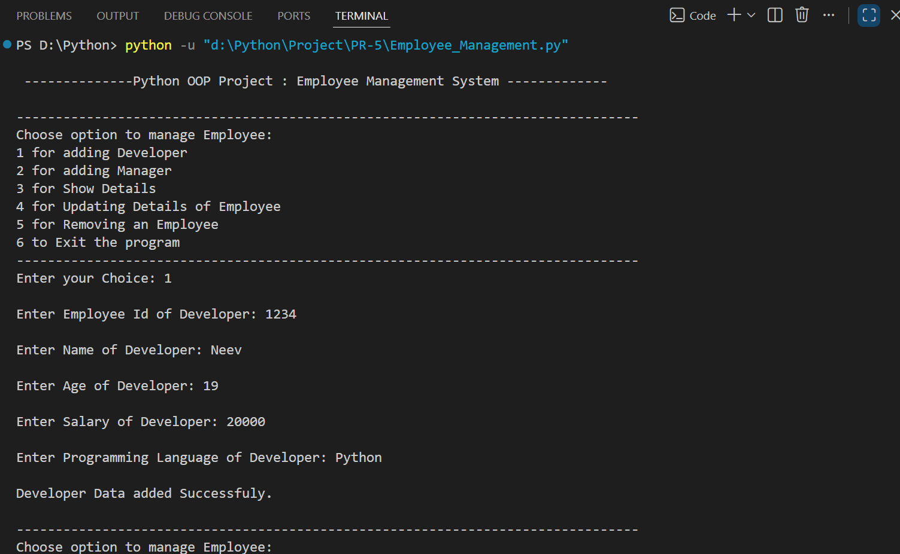

> *System launch with the main menu. Adding Developer "Neev" (ID: 1234, Python, Salary: 20000).*

---

### 🔁 Duplicate ID Check & Adding Second Developer
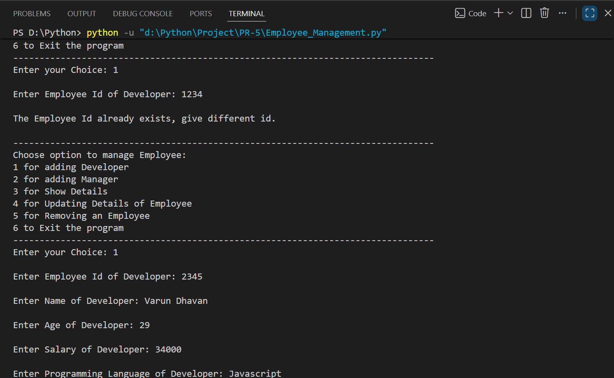

> *Attempting to re-use ID 1234 — system blocks it. Then adding Developer "Varun Dhavan" (ID: 2345, Javascript, Salary: 34000).*

---

### 👁️ Displaying Developers
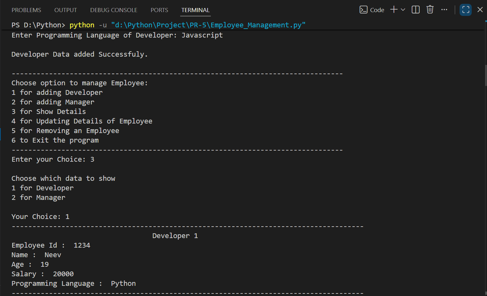

> *Choosing option 3 → 1 to display all developers. Both Developer 1 (Neev) and Developer 2 (Varun Dhavan) are shown.*

---

### ➕ Adding Managers
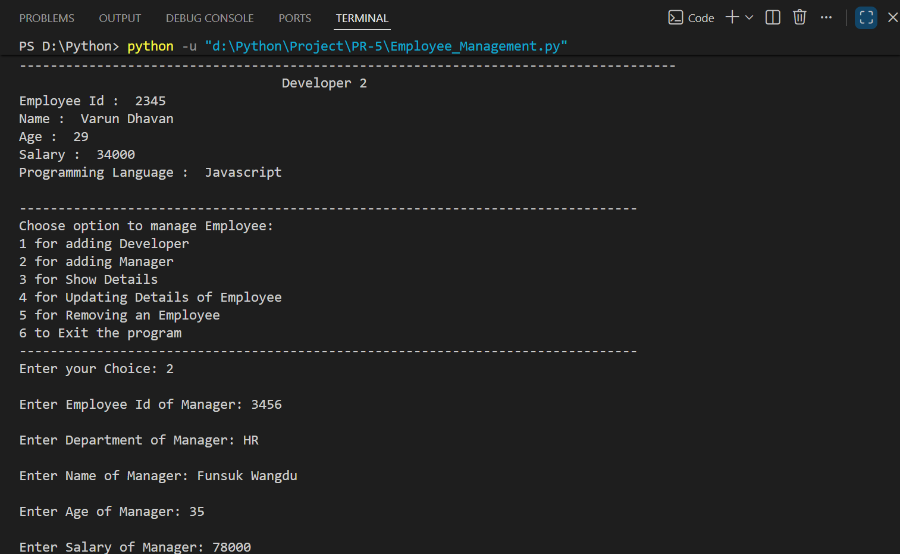

> *Adding Manager "Funsuk Wangdu" (ID: 3456, Dept: HR, Salary: 78000).*

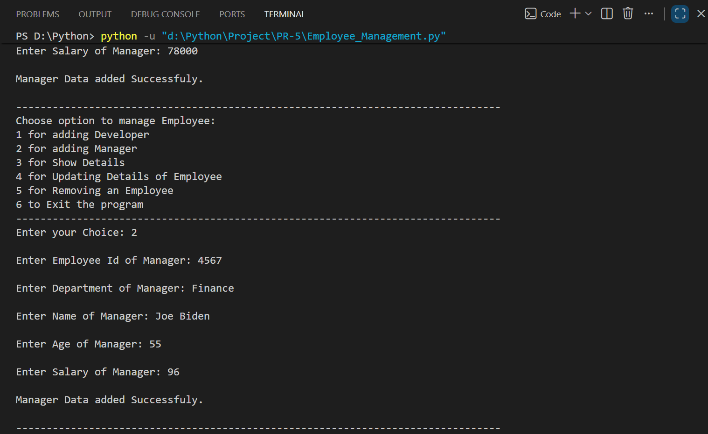

> *Adding Manager "Joe Biden" (ID: 4567, Dept: Finance, Salary: 96) — salary entered incorrectly, later updated.*

---

### 👁️ Displaying Managers
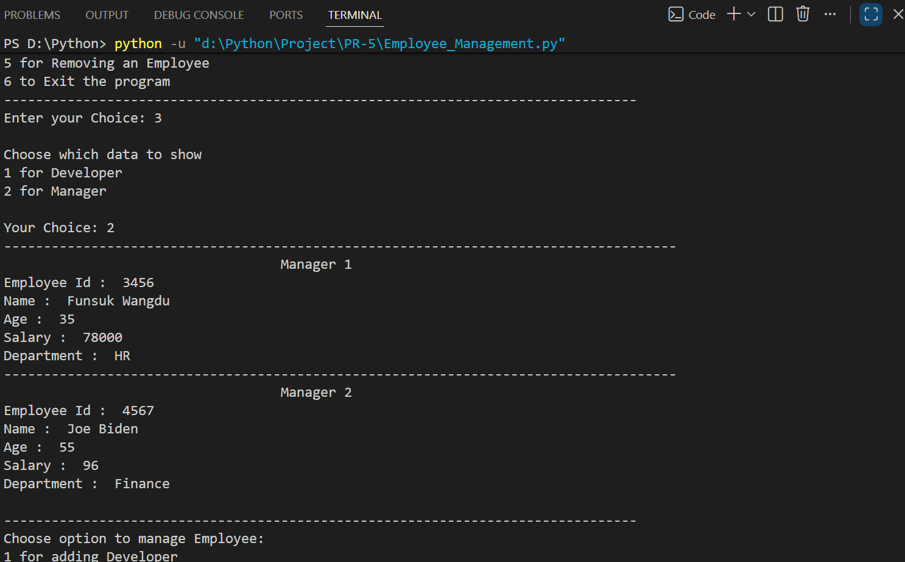

> *Choosing option 3 → 2 to display all managers. Both Manager 1 (Funsuk Wangdu, HR) and Manager 2 (Joe Biden, Finance) shown.*

---

### ✏️ Updating Developer Name
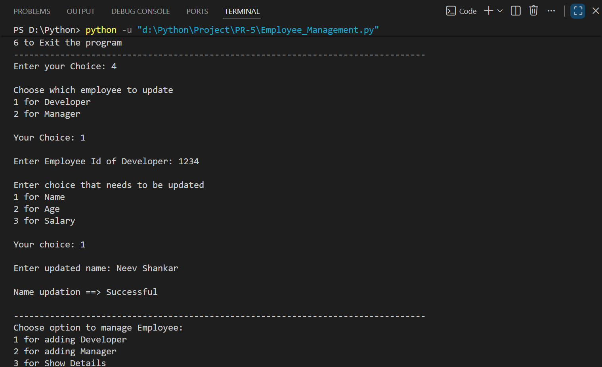

> *Choosing option 4 → 1. Updating Developer ID 1234's name from "Neev" to "Neev Shankar".*

---

### ✏️ Updating Manager Salary
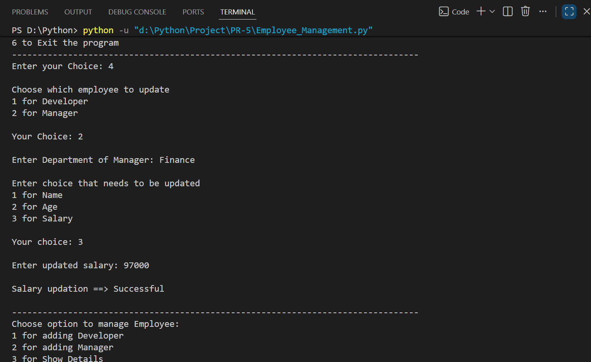

> *Choosing option 4 → 2. Updating Finance Manager's salary from 96 to 97000.*

---

### 👁️ Verifying Updates — Developers
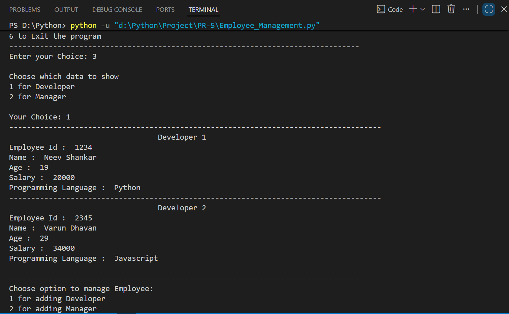

> *Displaying Developers again — confirms Developer 1 name now shows "Neev Shankar".*

---

### 👁️ Verifying Updates — Managers
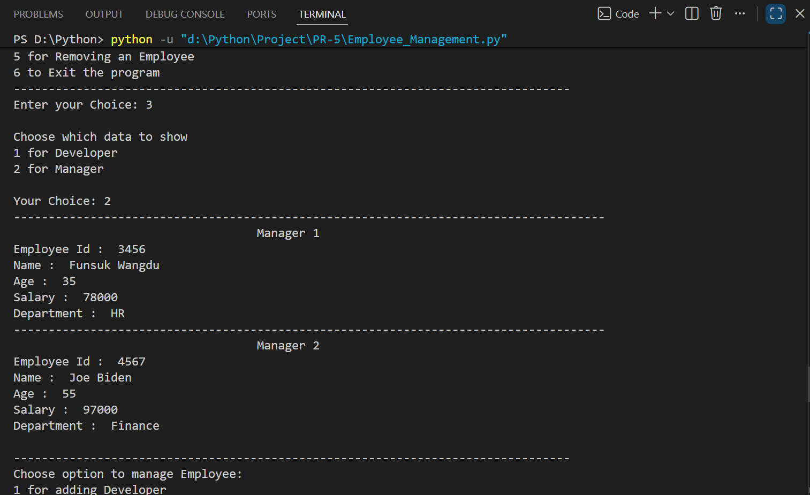

> *Displaying Managers again — confirms Manager 2 (Finance) salary now shows 97000.*

---

### 🗑️ Removing a Developer
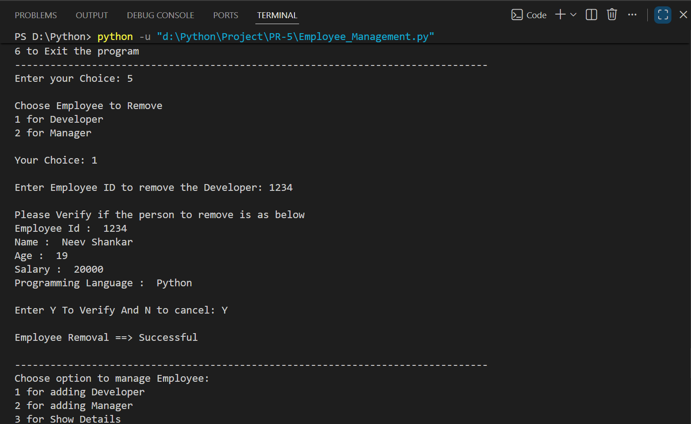

> *Choosing option 5 → 1. Verifies Developer ID 1234 (Neev Shankar) and confirms removal with "Y". Employee Removal → Successful.*

---

### 🗑️ Canceling Manager Removal
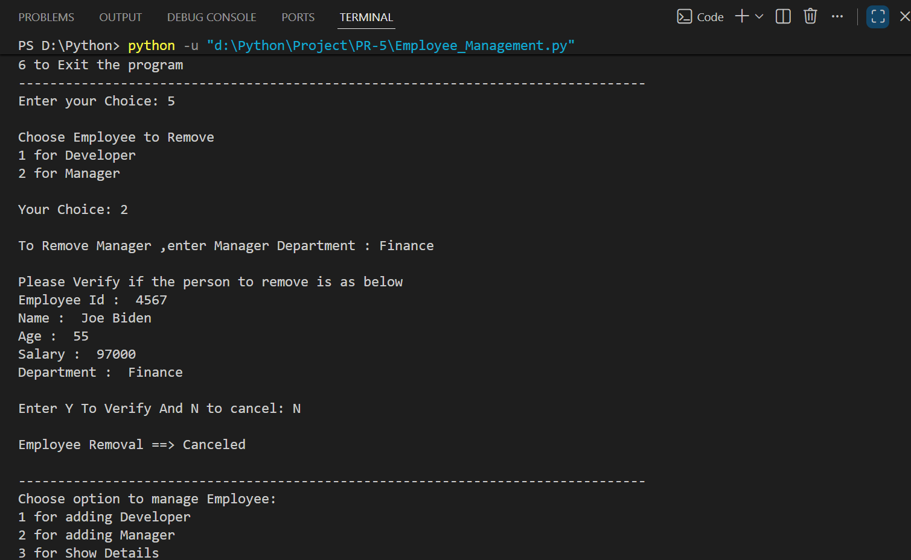

> *Choosing option 5 → 2. Verifies Finance Manager, but user enters "N" to cancel. Employee Removal → Canceled.*

---

### 🚪 Exiting the System

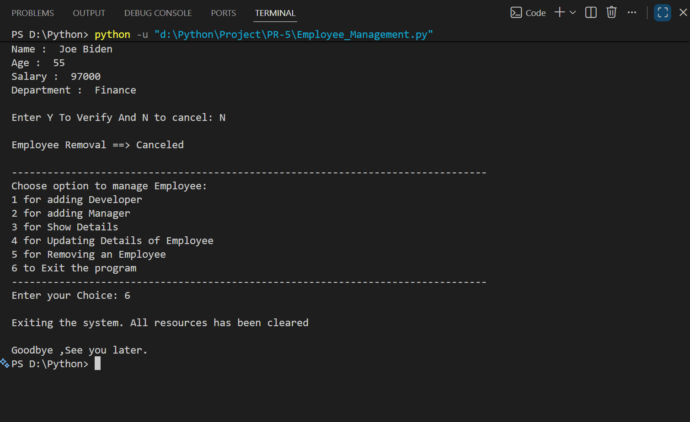

> *Choosing option 6. System clears all data and prints "Goodbye, See you later."*

---

## 🏆 Advantages

| Advantage | Detail |
|-----------|--------|
| 🎓 **OOP-Focused** | Directly demonstrates Encapsulation, Inheritance, and Abstraction |
| 🔒 **Data Safety** | Private salary/ID fields cannot be accessed directly outside the class |
| 🔄 **Extensible** | New roles (e.g. `Intern`, `Contractor`) can be added by subclassing `Employee` |
| 🖥️ **No Dependencies** | Runs with pure Python — no external libraries needed |
| ⚡ **Lightweight** | Single-file script, instantly runnable from any terminal |
| 🧪 **Validated Input** | Duplicate IDs, missing departments, and invalid choices are all caught |
| 📖 **Readable Code** | `match-case` structure keeps menu logic clean and easy to follow |
| 🧹 **Clean Exit** | Memory is explicitly cleared on exit for proper resource management |

---

## 📄 License

This project is licensed under the **MIT License** — see the [LICENSE](LICENSE) file for full details.

```
MIT License — Free to use, modify, and distribute with attribution.
```

---

## 👤 Author

<div align="center">

### Neev Shankar

> *"Every class is a blueprint, every object is a story — build systems that tell the right one."*

**🎓 Role:** Junior Python Developer | OOP Enthusiast \
**📍 Location:** India\
**🛠️ Skills:** Python · OOP · Inheritance · Encapsulation · CLI Applications · Pattern Matching

</div>

---

## 🙏 Acknowledgements

Special thanks to the following resources and communities that made this project possible:

- 📚 [Python Official Docs](https://docs.python.org/3/) — Official Python language reference
- 🏛️ [Real Python — OOP](https://realpython.com/python3-object-oriented-programming/) — In-depth OOP tutorials
- 🔒 [GeeksForGeeks — Access Modifiers](https://www.geeksforgeeks.org/access-modifiers-in-python-public-private-and-protected/) — Access modifier reference
- 🖥️ [W3Schools Python](https://www.w3schools.com/python/) — Beginner Python reference
- 🔀 [Python match-case Docs](https://docs.python.org/3/reference/compound_stmts.html#match) — Structural pattern matching guide
- 💬 [Stack Overflow Community](https://stackoverflow.com/) — Problem-solving support
- 📖 [Kaggle Learn](https://www.kaggle.com/learn) — Python and programming courses

---

<div align="center">

---

*Made with ❤️ and ☕ — Last updated: 12 June, 2026*

</div>
