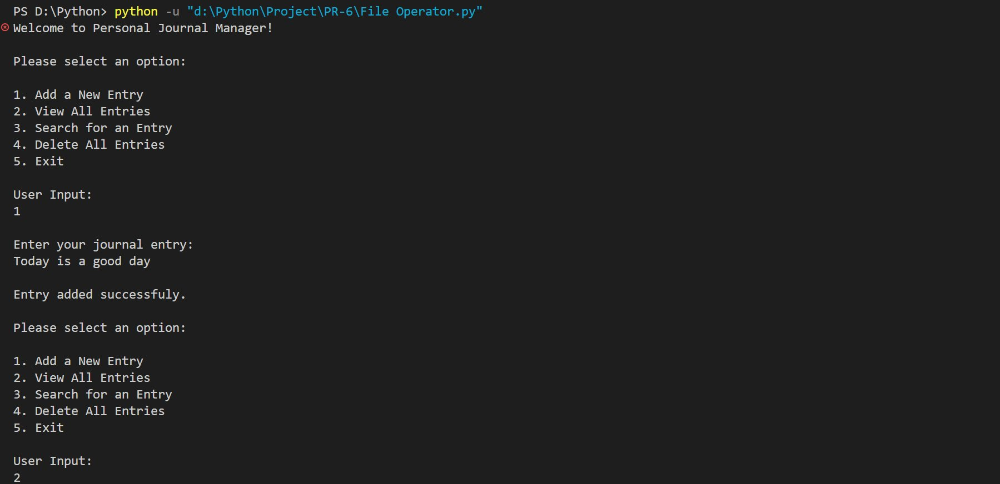
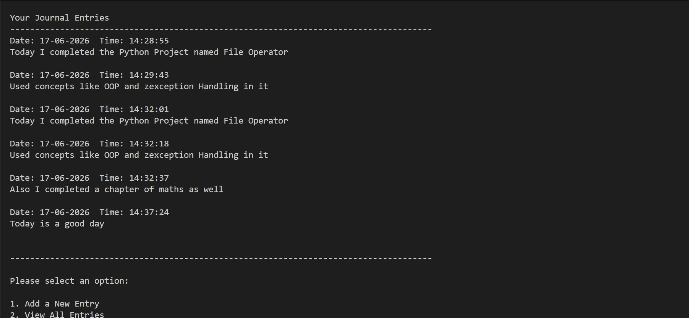
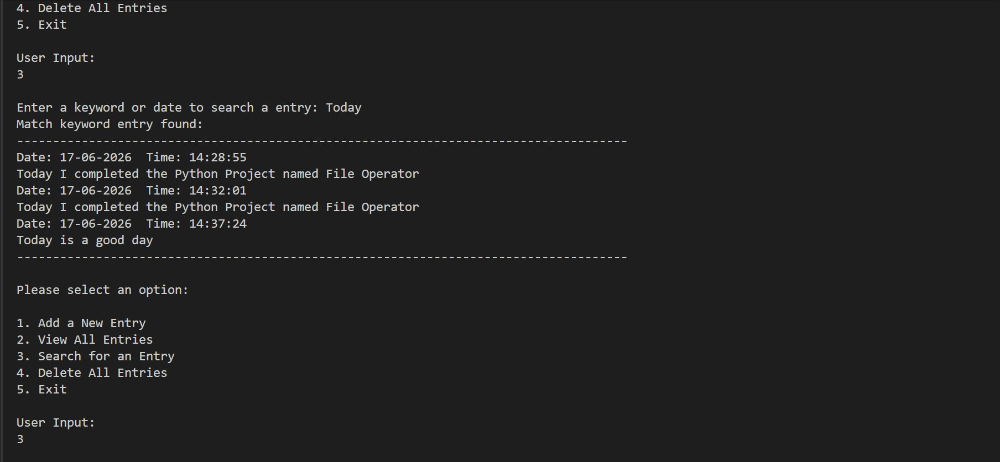
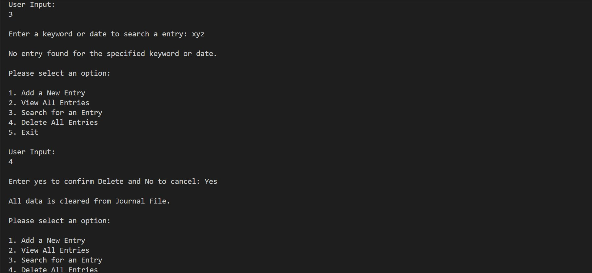
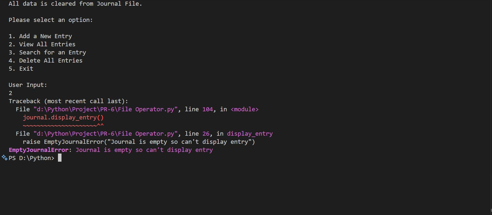

<div align="center">

# 📓 Personal Journal Manager
### *Interactive Console-Based File Handling & Exception Management in Python*

[](https://www.python.org/)
[](https://www.python.org/)
[](https://www.python.org/)
[](https://www.python.org/)

<br/>

> *"A journal is the mirror of the mind — and every great program starts with handling the unexpected gracefully."*

</div>

---

## 📋 Table of Contents

- [📌 Overview](#-overview)
- [🎯 Problem Statement](#-problem-statement)
- [✨ Key Features](#-key-features)
- [🏗️ Project Structure](#️-project-structure)
- [🔄 Project Workflow](#-project-workflow)
- [📁 Part A — File Handling](#-part-a--file-handling)
- [⚠️ Part B — Exception Handling](#️-part-b--exception-handling)
- [🛠️ Tech Stack](#️-tech-stack)
- [📈 Results & Output Screenshots](#-results--output-screenshots)
- [🏆 Advantages](#-advantages)
- [📄 License](#-license)
- [👤 Author](#-author)
- [🙏 Acknowledgements](#-acknowledgements)

---

## 📌 Overview

The **Personal Journal Manager** is a beginner-friendly, interactive Python console application that demonstrates core programming concepts such as **File I/O**, **OOP**, **custom exceptions**, and **match-case control flow**. The program presents a menu-driven interface that runs continuously until the user chooses to exit.

This project is designed to:
- Strengthen understanding of Python **file operations** (`open`, `read`, `write`, `append`)
- Practice **custom exception classes** and structured exception handling with `try-except-else`
- Apply **OOP design** by encapsulating all journal logic inside a `JournalManager` class
- Demonstrate **real-world journaling logic** — timestamped entries, keyword search, and safe deletion

---

## 🎯 Problem Statement

> **Objective:** Build a console-based interactive Personal Journal Manager using Python File Handling and Exception Handling concepts.

You are building a utility program for users who want to maintain a personal journal through the terminal. The program must accept user choices from a menu and execute the corresponding task — writing timestamped entries to a file, displaying all entries, searching by keyword or date, or clearing the journal.

| 📂 Feature | 📄 Type | 🔍 Description |
|------------|---------|----------------|
| Add New Entry | File Write (Append) | Writes a timestamped journal entry to `Journal.txt` |
| View All Entries | File Read | Reads and displays all stored journal entries |
| Search Entry | File Read + Filter | Searches entries by keyword or date string |
| Delete All Entries | File Write (Overwrite) | Clears all journal content with Y/N confirmation |
| Custom Exception | OOP + Exception | `EmptyJournalError` raised when journal has no content |

The goal is to demonstrate **Python File Handling and Exception Handling** through a clean, menu-driven interactive program.

---

## ✨ Key Features

| Feature | Description |
|--------|-------------|
| 🔁 **Infinite Menu Loop** | Program runs continuously until user selects Exit (choice 5) |
| 📝 **Timestamped Entries** | Each entry is automatically tagged with the current date and time |
| 📖 **View All Entries** | Displays full journal content with formatted separators |
| 🔍 **Keyword / Date Search** | Case-insensitive search across all entries by any word or date |
| 🗑️ **Safe Delete** | Requires `yes` confirmation before clearing all journal data |
| ⚠️ **Custom Exception** | `EmptyJournalError` raised when operations are attempted on an empty journal |
| 🛡️ **Multi-Layer Error Handling** | Handles `FileNotFoundError`, `PermissionError`, `ValueError`, `TypeError` |
| 🔢 **Match-Case Dispatch** | Python 3.10+ structural pattern matching for clean menu control |
| 🏛️ **OOP Design** | All logic encapsulated inside the `JournalManager` class |
| ✅ **Input-Driven Flow** | Fully driven by user input with branching via `match-case` |

---

## 🏗️ Project Structure

```
📦 personal-journal-manager/
│
├── 📄 File_Operator.py       ← Main Python script (entry point)
├── 📄 Journal.txt            ← Auto-created journal file (generated at runtime)
│
└── 📄 README.md              ← Project documentation
```

---

## 🔄 Project Workflow

```
Program Start
      │
      ▼
┌─────────────────────────────┐
│   Display Main Menu         │  ← Options: Add / View / Search / Delete / Exit
└────────────┬────────────────┘
             │
     ┌───────┼────────────┐
     ▼       ▼            ▼
  Choice 1  Choice 2   Choice 3
  (Add)     (View)     (Search)
     │         │           │
     ▼         ▼           ▼
  Append    Read &      Read & Filter
  to File   Display     by Keyword
     │         │           │
     └─────────┴───────────┘
             │
       Choice 4           Choice 5
       (Delete)           (Exit) ✅
          │
     Confirm Y/N
          │
     Clear File
          │
     Loop Back to Menu
```

---

## 📁 Part A — File Handling

### 📝 1. Add New Entry (`new_entry`)

> Appends a timestamped journal entry to `Journal.txt` using `append` mode.

**Logic:**
```python
self.timestamp = datetime.datetime.now().strftime("Date: %d-%m-%Y  Time: %H:%M:%S")
with open(self.filename, 'a') as file:
    file.write(f'{self.timestamp}\n{self.entry}\n\n')
```

**Key Concepts Used:**

| Concept | Detail |
|---------|--------|
| 📂 `open(file, 'a')` | Append mode — adds to file without overwriting |
| 🕐 `datetime.now()` | Captures current timestamp for each entry |
| 🖨️ `strftime()` | Formats timestamp as `Date: DD-MM-YYYY  Time: HH:MM:SS` |

---

### 👁️ 2. View All Entries (`display_entry`)

> Reads the entire journal file and prints all entries with separators.

**Logic:**
```python
with open(self.filename, 'r') as f:
    content = f.read()
print(content)
```

---

### 🔍 3. Search Entry (`search_entry`)

> Searches all journal entries for a user-provided keyword or date string (case-insensitive).

**Logic:**
```python
self.content = list(file.read().split("\n\n"))
for entry in self.content:
    if self.search_word.lower() in entry.lower():
        self.match_content.append(entry)
```

**Key Concepts Used:**

| Concept | Detail |
|---------|--------|
| 🔡 `.lower()` | Case-insensitive comparison |
| 📋 `.split("\n\n")` | Splits file content into individual entries |
| 📝 List accumulation | Matching entries collected into `match_content` list |

---

### 🗑️ 4. Delete All Entries (`delete_element`)

> Overwrites the journal file with empty content after Y/N confirmation.

**Logic:**
```python
if final_choice.lower() == 'yes':
    with open(self.filename, 'w') as file:
        pass   # Opening in 'w' mode with no write clears the file
```

---

## ⚠️ Part B — Exception Handling

### 🔴 1. Custom Exception — `EmptyJournalError`

> A custom exception class raised when the user tries to view, search, or delete from an empty journal.

```python
class EmptyJournalError(Exception):
    pass
```

**Raised when:**
```python
if content == "":
    raise EmptyJournalError("Journal is empty so can't display entry")
```

---

### 🛡️ 2. Multi-Layer Exception Handling

| Exception | Where Handled | Reason |
|-----------|--------------|--------|
| `FileNotFoundError` | All read methods | Triggered when `Journal.txt` doesn't exist yet |
| `PermissionError` | All file methods | Triggered when OS denies file access |
| `EmptyJournalError` | View / Search / Delete | Custom error for empty journal operations |
| `ValueError` | Menu input | Triggered when user enters non-integer input |
| `TypeError` | Menu input | Triggered for unexpected type in input |
| `Exception` | Menu input catch-all | Generic fallback for any other runtime errors |

**Pattern used — `try-except-else`:**
```python
try:
    f = open(self.filename, 'r')
    content = f.read()
except FileNotFoundError:
    print("\nNo Journal entries found. Start by adding a new entry.")
except PermissionError:
    print("Error: Permission denied.")
else:
    if content == "":
        raise EmptyJournalError("Journal is empty")
    else:
        print(content)
```

---

## 🛠️ Tech Stack

| Tool | Version | Purpose |
|------|---------|---------|
| 🐍 **Python** | 3.10+ | Core programming language |
| 📁 **File I/O** | Built-in | `open()` with `r`, `w`, `a` modes for journal operations |
| 🕐 **datetime** | Built-in | Timestamping each journal entry |
| ⚠️ **Custom Exception** | Built-in | `EmptyJournalError` extends `Exception` |
| 🏛️ **OOP Class** | Built-in | `JournalManager` encapsulates all journal operations |
| 🔢 **Match-Case** | Python 3.10+ | Structural pattern matching for menu dispatch |
| 🖨️ **print() / input()** | Built-in | Console I/O and user interaction |
| 🔄 **While Loop** | Built-in | Infinite menu loop control |

---

## 📈 Results & Output Screenshots

After running the program, the following outputs are produced:

- ✅ **Timestamped Entry Added** — Each journal entry saved with exact date and time
- 📖 **All Entries Displayed** — Full journal content shown with formatted separators
- 🔍 **Keyword Search** — Matching entries returned; "No match" shown when not found
- 🗑️ **Safe Delete** — Journal cleared after `yes` confirmation
- ⚠️ **Custom Error Raised** — `EmptyJournalError` triggered when journal is empty after deletion

---

### 🖥️ 1. Adding a New Entry & Main Menu

> Program starts, displays the main menu. User selects `1` and enters a journal entry. Entry is saved with timestamp and success message is shown.



---

### 🖥️ 2. Viewing All Entries

> User selects `2`. All stored journal entries are displayed with timestamps and formatted separators.



---

### 🖥️ 3. Searching by Keyword — Match Found

> User selects `3` and enters keyword `Today`. All entries containing the word are displayed.



---

### 🖥️ 4. Searching — No Match & Deleting All Entries

> Search for keyword `xyz` returns no results. User then selects `4`, confirms with `Yes`, and the journal is cleared.



---

### 🖥️ 5. Custom Exception — EmptyJournalError

> After deletion, user selects `2` (View). Since the journal is now empty, `EmptyJournalError` is raised and the traceback is displayed.



---

## 🏆 Advantages

| Advantage | Detail |
|-----------|--------|
| 🎓 **Beginner Friendly** | Core concepts: File I/O, OOP, and Exception Handling in one project |
| 📁 **Real File Persistence** | Data is stored in an actual `.txt` file, persisting between runs |
| 🔄 **Reusability** | `JournalManager` class can be extended with edit, export, or encrypt features |
| 📚 **Educational** | Demonstrates `try-except-else`, custom exceptions, and `match-case` together |
| 🖥️ **No Dependencies** | Runs with pure Python — no external libraries needed |
| ⚡ **Lightweight** | Single-file script, instantly runnable from any terminal |
| 🧪 **Extensible** | Easy to add features like entry editing, date filtering, or multiple journals |
| 🛡️ **Robust Error Handling** | Six distinct exception types handled across all menu operations |

---

## 📄 License

This project is licensed under the **MIT License** — see the [LICENSE](LICENSE) file for full details.

```
MIT License — Free to use, modify, and distribute with attribution.
```

---

## 👤 Author

<div align="center">

### Neev Shankar


> *"Every entry starts with a single line — just like every program starts with a single thought."*

**🎓 Role:** Junior Python Developer | Programming Enthusiast \
**📍 Location:** India \
**🛠️ Skills:** Python · File Handling · OOP · Exception Handling · CLI Applications

</div>

---

## 🙏 Acknowledgements

Special thanks to the following resources and communities that made this project possible:

- 📚 [Python Official Docs](https://docs.python.org/3/) — Official Python language reference
- 📁 [Real Python — File I/O](https://realpython.com/read-write-files-python/) — In-depth file handling tutorials
- ⚠️ [Real Python — Exceptions](https://realpython.com/python-exceptions/) — Custom exception guides
- 🖥️ [W3Schools Python](https://www.w3schools.com/python/) — Beginner Python reference
- 🔢 [Python Match-Case Docs](https://docs.python.org/3/reference/compound_stmts.html#match) — Structural pattern matching
- 💬 [Stack Overflow Community](https://stackoverflow.com/) — Problem-solving support
- 📖 [Kaggle Learn](https://www.kaggle.com/learn) — Python and programming courses

---

<div align="center">

---

*Made with ❤️ and ☕ — Last updated: 17 June, 2026*

</div>
