<div align="center">

# -- ! Multi-Utility Toolkit ! --
### *Interactive Console-Based Python Utility Suite*

[](https://www.python.org/)
[](https://www.python.org/)
[](https://www.python.org/)
[](https://www.python.org/)

<br/>

> *"Python's standard library is a universe of tools — this toolkit brings the best of it to your fingertips."*

</div>

---

## 📋 Table of Contents

- [-- ! Multi-Utility Toolkit ! --](#----multi-utility-toolkit----)
    - [*Interactive Console-Based Python Utility Suite*](#interactive-console-based-python-utility-suite)
  - [📋 Table of Contents](#-table-of-contents)
  - [📌 Overview](#-overview)
  - [🎯 Problem Statement](#-problem-statement)
  - [✨ Key Features](#-key-features)
  - [🏗️ Project Structure](#️-project-structure)
  - [🔄 Project Workflow](#-project-workflow)
  - [🕐 Module 1 — Datetime \& Time Operations](#-module-1--datetime--time-operations)
  - [🔢 Module 2 — Mathematical Operations](#-module-2--mathematical-operations)
  - [🎲 Module 3 — Random Data Generation](#-module-3--random-data-generation)
  - [🔑 Module 4 — UUID Generation](#-module-4--uuid-generation)
  - [📁 Module 5 — File Operations](#-module-5--file-operations)
  - [🔍 Module 6 — Explore Module Attributes](#-module-6--explore-module-attributes)
  - [🛠️ Tech Stack](#️-tech-stack)
  - [📈 Results \& Output](#-results--output)
    - [▶️ Main Menu \& Datetime Submenu](#️-main-menu--datetime-submenu)
    - [📅 Date Difference \& Format Conversion](#-date-difference--format-conversion)
    - [⏱️ Stopwatch \& More Format Options](#️-stopwatch--more-format-options)
    - [🔢 Mathematical Operations](#-mathematical-operations)
    - [🎲 Random Data Generation](#-random-data-generation)
    - [🔑 UUID Generation](#-uuid-generation)
    - [📁 File Operations](#-file-operations)
    - [🔍 Module Attribute Explorer](#-module-attribute-explorer)
    - [🚪 Exit](#-exit)
  - [🏆 Advantages](#-advantages)
  - [📄 License](#-license)
  - [👤 Author](#-author)
    - [Neev Shankar](#neev-shankar)
  - [🙏 Acknowledgements](#-acknowledgements)

---

## 📌 Overview

The **Multi-Utility Toolkit** is a comprehensive, menu-driven Python console application that consolidates six distinct utility modules into a single interactive program. It covers datetime handling, mathematical computations, random data generation, UUID creation, file I/O, and Python module introspection — all accessible from one unified interface.

Built with a clean **package-based architecture**, the project separates each domain into its own module file (`Datetime_Module.py`, `Math_Module.py`, `File_Module.py`) under a `Package/` directory, with `Toolkit.py` serving as the central entry point.

This project is designed to:
- Demonstrate practical use of Python's built-in standard library modules
- Build confidence with real-world utility programming patterns
- Practice modular project design with packages and imports
- Apply file handling, randomness, math, and datetime APIs in one cohesive project

---

## 🎯 Problem Statement

> **Objective:** Build a single-entry console toolkit that gives users on-demand access to six categories of Python utilities without needing separate scripts.

| 📂 Module | 📄 Type | 🔍 Description |
|-----------|---------|----------------|
| Datetime & Time | Utility | Current time, date diff, format conversion, stopwatch |
| Mathematical | Computation | Factorial, circle area, trigonometry (sin/cos) |
| Random Data | Generation | Random numbers, lists, passwords, OTPs |
| UUID | Identifier | Generate universally unique identifiers |
| File Operations | I/O | Create, write, read, and append to text files |
| Module Explorer | Introspection | List all attributes of any importable Python module |

---

## ✨ Key Features

| Feature | Description |
|--------|-------------|
| 🔁 **Persistent Main Menu** | Program loops continuously until user selects Exit |
| 🗂️ **6 Independent Modules** | Each module has its own sub-menu and back-navigation |
| 📦 **Package-Based Design** | `Datetime_Module`, `Math_Module`, and `File_Module` live in a `Package/` folder |
| 🕐 **Live Date & Time** | Displays current system date and time |
| 📅 **Date Difference** | Computes the gap between two user-entered dates |
| 🗓️ **6 Format Options** | Converts dates into various display formats including day names |
| ⏱️ **Stopwatch** | Press Enter to start/stop; reports elapsed seconds |
| 🔢 **Factorial & Trig** | Computes factorial, circle area, sin and cos |
| 🎲 **Random Generator** | Numbers, lists, passwords (with length validation), OTPs |
| 🔑 **UUID v4** | Generates RFC-compliant universally unique identifiers |
| 📄 **File CRUD** | Full create/write/read/append support with error handling |
| 🔍 **Module Inspector** | Uses `dir()` to list any module's attributes dynamically |
| ⚠️ **Input Validation** | Invalid inputs, bad menu choices, and missing files produce clear error messages |

---

## 🏗️ Project Structure

```
📦 multi-utility-toolkit/
│
├── 📄 Toolkit.py                  ← Main entry point (run this file)
│
├── 📁 Package/                    ← Module package directory
│   ├── 📄 __init__.py             ← Makes Package a Python package
│   ├── 📄 Datetime_Module.py      ← Date, time, format, stopwatch logic
│   ├── 📄 Math_Module.py          ← Factorial, area, trigonometry logic
│   └── 📄 File_Module.py          ← File create, write, read, append logic
│
└── 📄 README.md                   ← Project documentation
```

> **How to run:** Navigate to the project folder in your terminal and execute:
> ```bash
> python Toolkit.py
> ```

---

## 🔄 Project Workflow

```
Program Start  →  Toolkit.py  →  main()
                                   │
                        ┌──────────▼──────────┐
                        │   Display Main Menu  │  ← 7 options
                        └──────────┬──────────┘
                                   │
         ┌─────────────────────────┼──────────────────────────┐
         ▼                         ▼                          ▼
   ┌───────────┐            ┌────────────┐            ┌──────────────┐
   │  Choice 1 │            │ Choice 2/3 │            │ Choice 4/5/6 │
   │  DateTime │            │  Math /    │            │ UUID / File /│
   │  Sub-menu │            │  Random    │            │  Dir()       │
   └─────┬─────┘            └─────┬──────┘            └──────┬───────┘
         │                        │                          │
         ▼                        ▼                          ▼
  ┌────────────────────────────────────────────────────────────────┐
  │    Package import → Function call → Output → Back to Menu      │
  └────────────────────────────────────────────────────────────────┘
                                   │
                          (Choice 7) Exit ✅
```

---

## 🕐 Module 1 — Datetime & Time Operations

**File:** `Package/Datetime_Module.py` | **Import:** `from Package import Datetime_Module as DTM`

| Option | Function | Details |
|--------|----------|---------|
| 1 | `Current_Datetime()` | Displays live system date (`DD/MM/YYYY`) and time (`HH:MM:SS`) |
| 2 | `Difference_Date()` | Input two `YYYY-MM-DD` dates; outputs the day difference |
| 3 | `Custom_Formatdate()` | 6 format choices: `DD/MM/YYYY`, `DD/MM/YY`, `MM-DD-YYYY`, `DD Month YYYY`, `Day DD Month YYYY`, `Day DD/MM/YY` |
| 4 | `Stopwatch()` | Press Enter to start, Enter again to stop; reports elapsed seconds via `time.time()` |

---

## 🔢 Module 2 — Mathematical Operations

**File:** `Package/Math_Module.py` | **Import:** `from Package import Math_Module as MM`

| Option | Function | Details |
|--------|----------|---------|
| 1 | `factorial_num()` | Input any non-negative integer; computes using `math.factorial()` |
| 2 | `circle_area()` | Input radius; computes `3.14 × r²` |
| 3 | `trigono()` | Input angle in degrees; converts to radians, outputs `sin` and `cos` values |

---

## 🎲 Module 3 — Random Data Generation

**Implemented directly in:** `Toolkit.py` | **Import:** `import random as r`

| Option | Details |
|--------|---------|
| Generate Random Number | `r.randint(0, 1000)` — single random integer |
| Generate Random List | `r.randint(3, 10)` elements, each in range 0–100 |
| Create Random Password | Length 4–16 enforced; shuffled mix of uppercase, lowercase, digits, and special chars |
| Generate Random OTP | Randomly selects length 4–7; generates matching-length numeric OTP |

---

## 🔑 Module 4 — UUID Generation

**Import:** `from uuid import uuid4 as u4`

Instantly generates a **RFC 4122 compliant UUID v4** string. No sub-menu — produces output directly and returns to the main menu.

Example output:
```
Generated ID is : 6fcc525d-cc12-4944-bded-74df0b39a253
```

---

## 📁 Module 5 — File Operations

**File:** `Package/File_Module.py` | **Import:** `from Package import File_Module as FM`

| Option | Function | Details |
|--------|----------|---------|
| 1 | `Create_File(filename)` | Creates an empty file using `open(filename, 'x')`; raises `FileExistsError` if already present |
| 2 | `Write_File(filename)` | Overwrites file content with user input; raises `FileNotFoundError` if file is missing |
| 3 | `Read_File(filename)` | Reads and prints full file content |
| 4 | `Append_File(filename)` | Appends new content without erasing existing data |

---

## 🔍 Module 6 — Explore Module Attributes

**Import:** `from importlib import import_module as impmod`

Takes any Python module name as input, imports it dynamically using `importlib`, and prints all its attributes via `dir()`. Works with any importable standard library module (e.g. `os`, `math`, `abc`, `datetime`). Raises a clear `ModuleNotFoundError` message if the module doesn't exist.

---

## 🛠️ Tech Stack

| Tool | Version | Purpose |
|------|---------|---------|
| 🐍 **Python** | 3.10+ | Core programming language |
| 📅 **datetime** | Built-in | Date/time display, difference, and format operations |
| ⏱️ **time** | Built-in | Stopwatch timing via `time.time()` |
| 🔢 **math** | Built-in | `factorial()`, `radians()`, `sin()`, `cos()` |
| 🎲 **random** | Built-in | `randint()`, list generation, password/OTP creation |
| 🔑 **uuid** | Built-in | `uuid4()` for RFC 4122 compliant UUID generation |
| 📁 **open()** | Built-in | File create (`x`), write (`w`), read (`r`), append (`a`) |
| 🔍 **importlib** | Built-in | Dynamic module import for the attribute explorer |
| 🔀 **match-case** | Python 3.10+ | Structural pattern matching for all menu logic |
| 📦 **Package** | Custom | Local package containing `Datetime_Module`, `Math_Module`, `File_Module` |

---

## 📈 Results & Output

---

### ▶️ Main Menu & Datetime Submenu

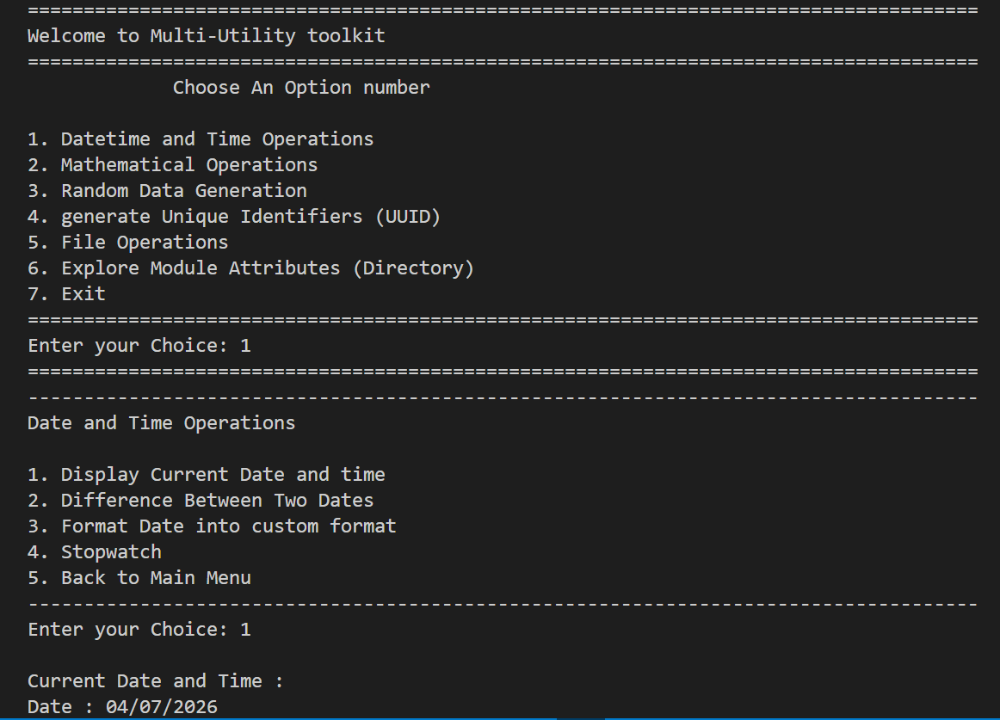
> *Toolkit launches showing all 6 modules. Selecting option 1 opens the Datetime sub-menu. Option 1 chosen — displays current Date (04/07/2026) and Time (17:58:30).*

---

### 📅 Date Difference & Format Conversion

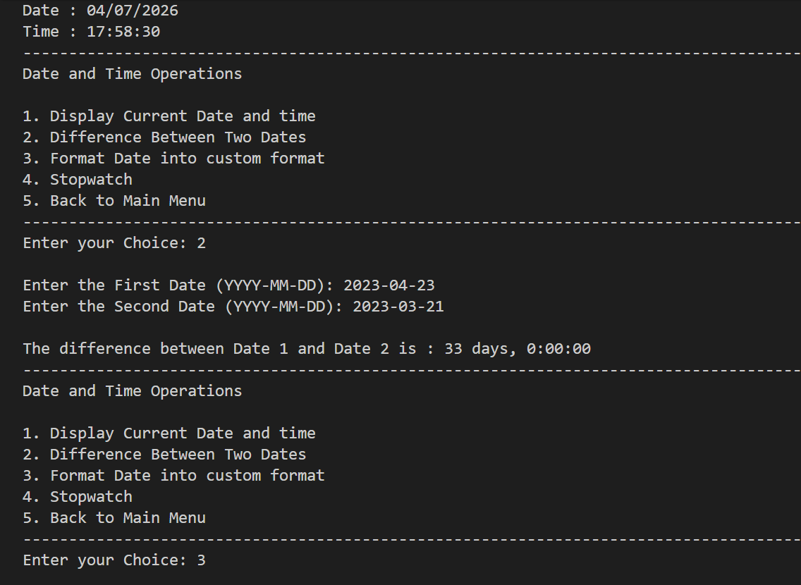
> *Option 2: difference between 2023-04-23 and 2023-03-21 computed as 33 days. Option 3 then selected to trigger format conversion.*

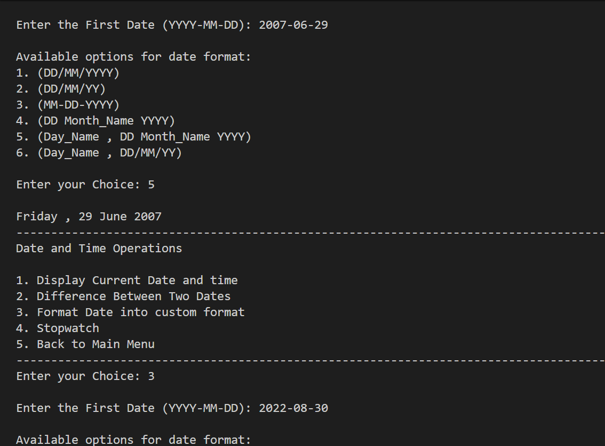
> *Date 2007-06-29 formatted with option 5 (Day_Name, DD Month_Name YYYY) outputs "Friday , 29 June 2007".*

---

### ⏱️ Stopwatch & More Format Options

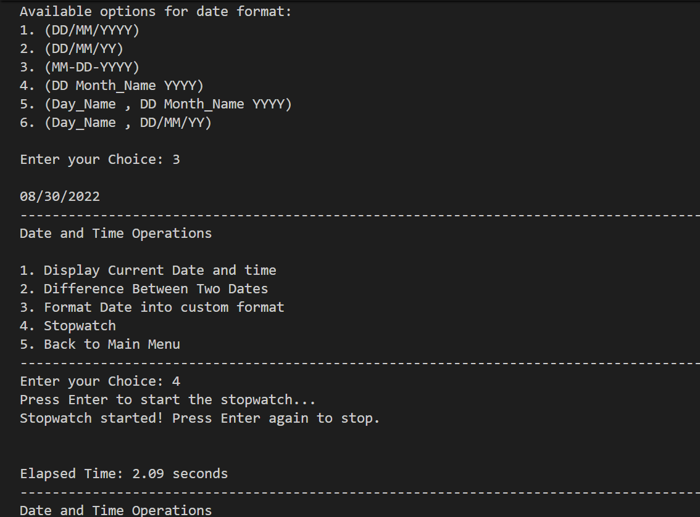
> *Date 2022-08-30 formatted with option 3 (MM-DD-YYYY) outputs 08/30/2022. Stopwatch then started and stopped — Elapsed Time: 2.09 seconds.*

---

### 🔢 Mathematical Operations

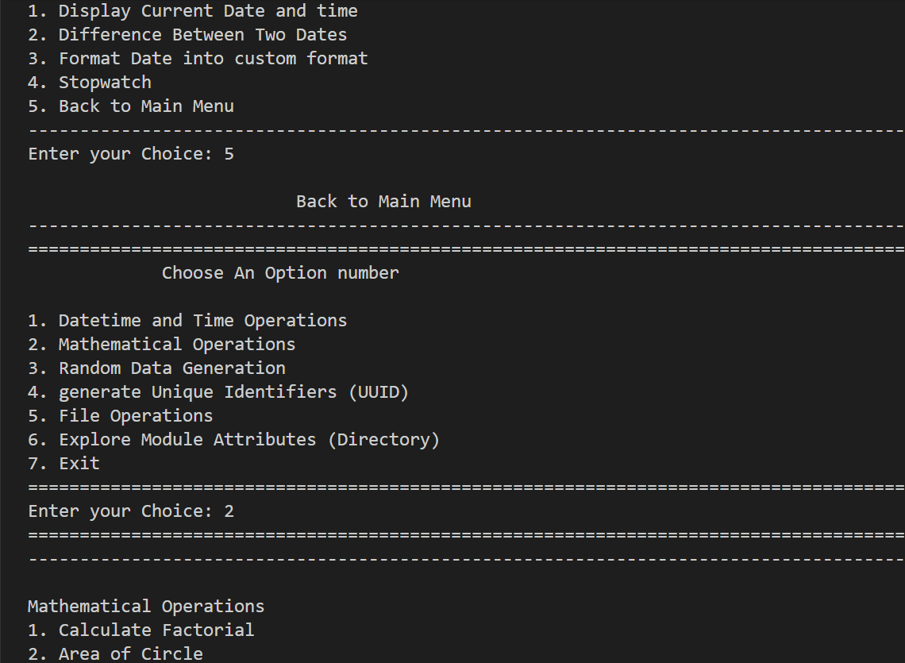
> *Factorial of 6 = 720. Area of circle with radius 45 = 6358.5. Trigonometric input angle 46.7° entered.*

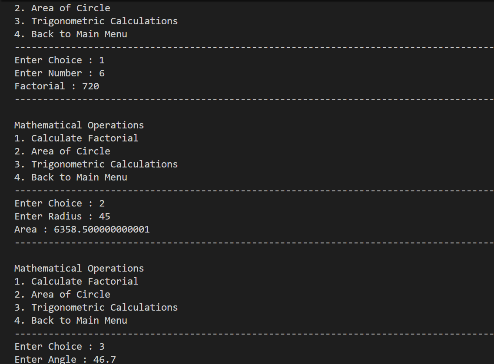
> *Sin(46.7°) ≈ 0.7278, Cos(46.7°) ≈ 0.6858 displayed. User selects Back to Main Menu, then proceeds to Random Data Generation.*

---

### 🎲 Random Data Generation

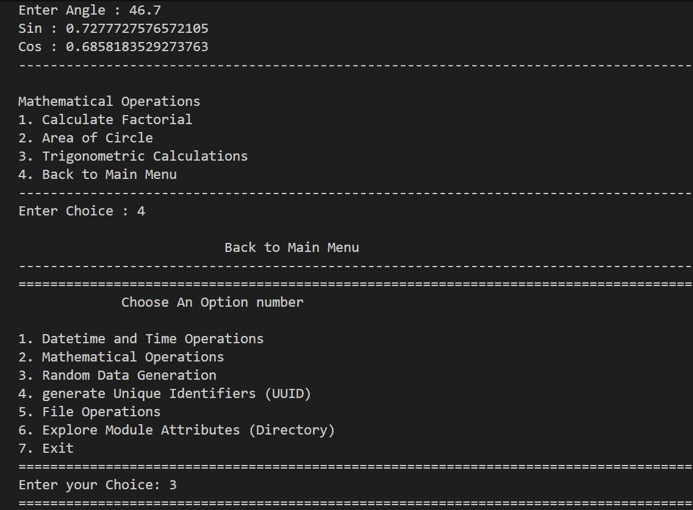
> *Option 1: random number 186 generated. Option 2: random list [2, 43, 60] generated.*

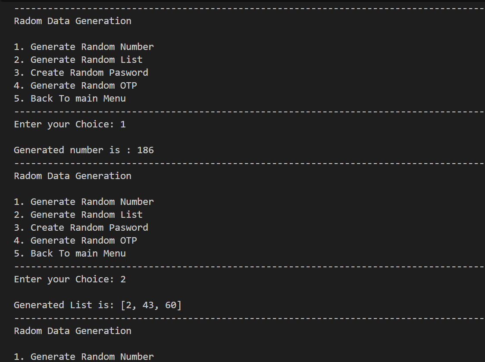
> *Password length 19 rejected (greater than 16). Length 10 accepted — password generated: `6vQ,hh<FWB`.*

---

### 🔑 UUID Generation

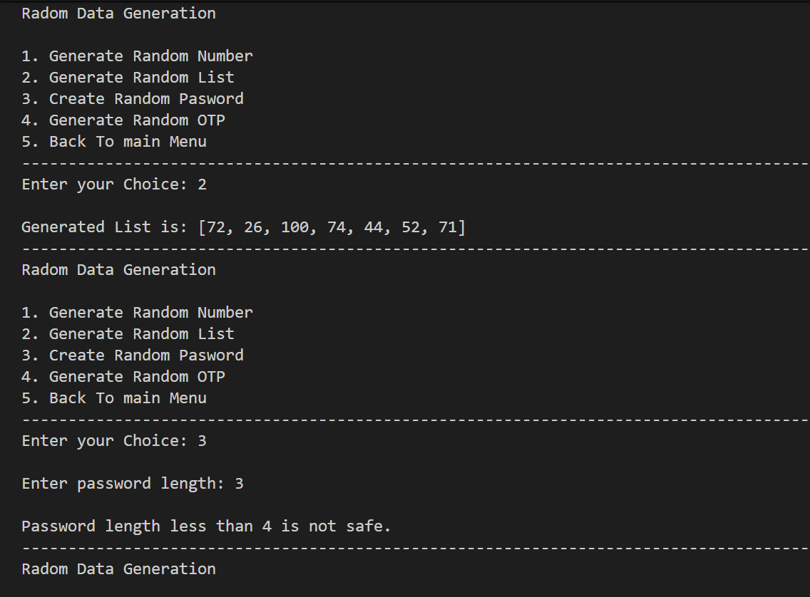
> *Option 4 from main menu instantly generates UUID: `6fcc525d-cc12-4944-bded-74df0b39a253`.*

---

### 📁 File Operations

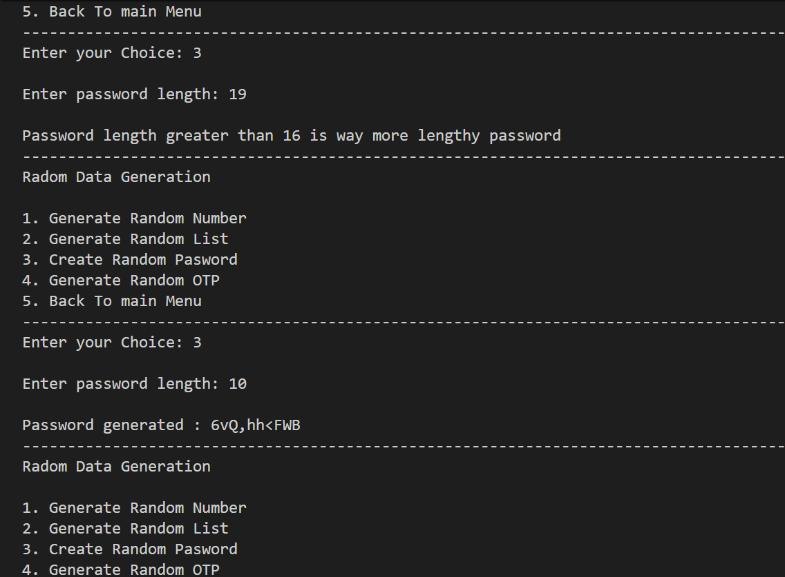
> *Non-numeric input caught and rejected. Option 1 then chosen: `textfile.txt` created successfully.*

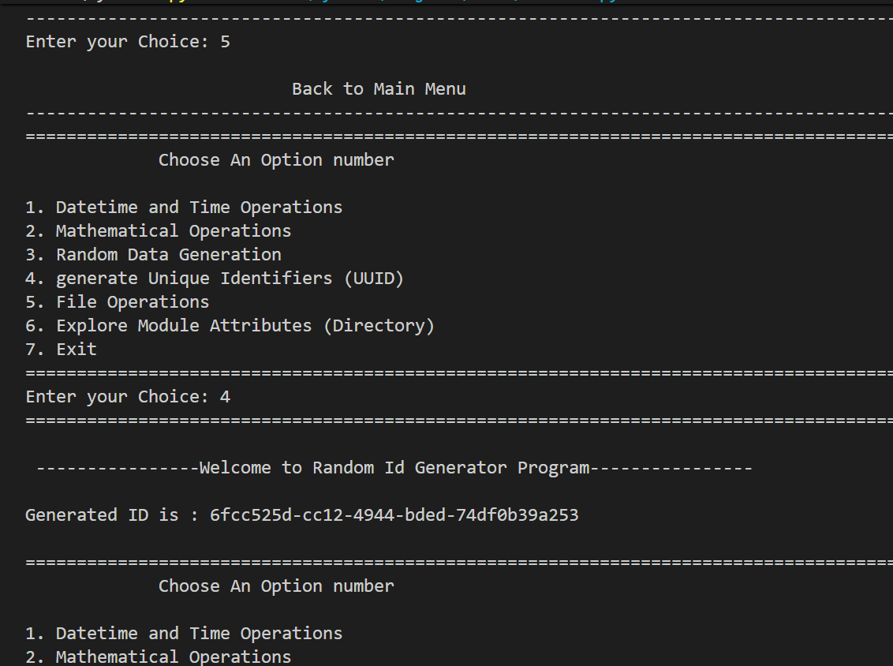
> *Option 2 writes "Hello World" to textfile.txt — overwrite successful. Option 3 reads and displays the content: "Hello World".*

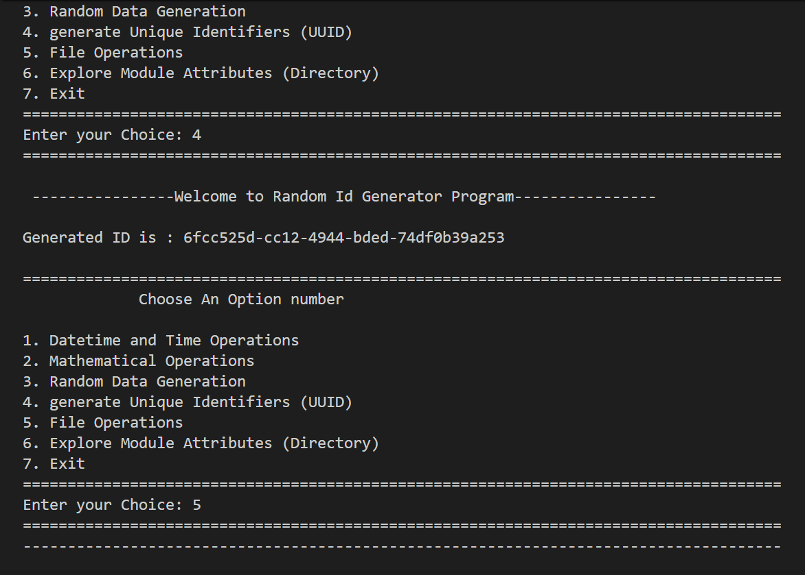
> *Option 4 appends "Welcome to development field". Option 3 reads updated file — both lines now present.*

---

### 🔍 Module Attribute Explorer

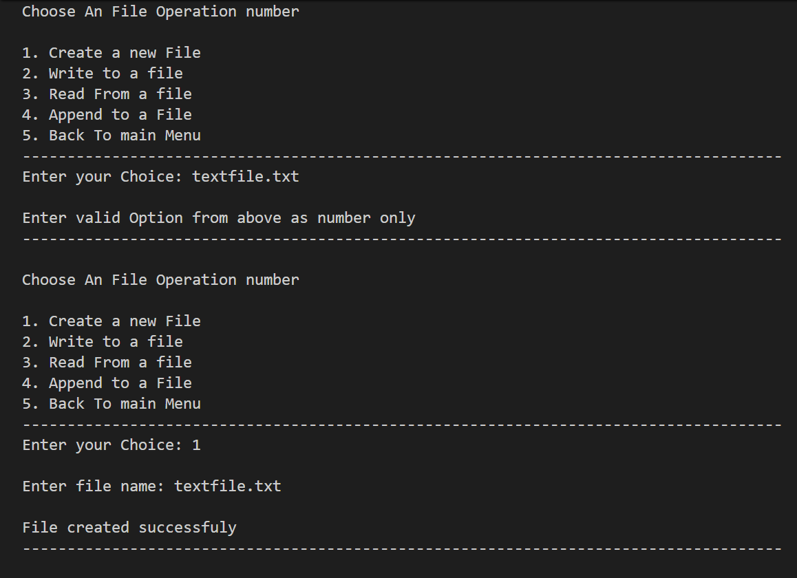
> *Module name "abc" entered. Available attributes listed starting with ABC, ABCMeta, \_\_builtins\_\_, \_\_doc\_\_, \_\_file\_\_ and more.*

---

### 🚪 Exit

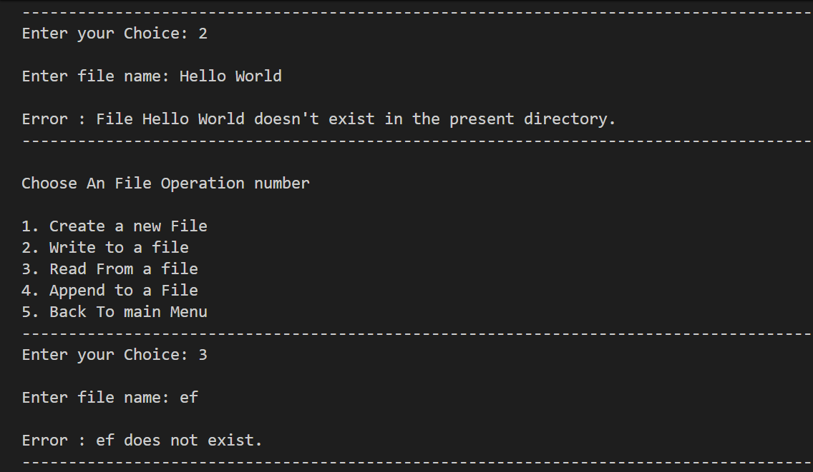
> *Option 7 selected. System prints "Thank You for using the Multi-Utility toolkit" and exits cleanly.*

---

## 🏆 Advantages

| Advantage | Detail |
|-----------|--------|
| 🎓 **All-in-One** | Six distinct utilities combined under a single entry point |
| 📦 **Modular Architecture** | Clean package structure keeps each domain separated and maintainable |
| 🖥️ **No Dependencies** | Runs entirely on Python's standard library — zero pip installs |
| ⚡ **Lightweight** | Pure Python, instantly runnable from any terminal |
| 🔁 **Persistent Navigation** | Menus loop until the user explicitly exits or goes back |
| ⚠️ **Robust Error Handling** | Missing files, invalid inputs, and bad module names all handled gracefully |
| 🔍 **Introspection Built-In** | Module explorer dynamically works on any importable Python module |
| 🔒 **Password Safety Rules** | Enforces minimum length 4 and maximum length 16 with clear feedback |
| 🧪 **Extensible** | New modules can be added to `Package/` and wired into `Toolkit.py` without refactoring |

---

## 📄 License

This project is licensed under the **MIT License** — see the [LICENSE](LICENSE) file for full details.

```
MIT License — Free to use, modify, and distribute with attribution.
```

---

## 👤 Author

<div align="center">

### Neev Shankar


> *"The best toolkit is the one that grows with you — one module at a time."*

**🎓 Role:** Junior Python Developer | Standard Library Enthusiast \
**📍 Location:** India \
**🛠️ Skills:** Python · Modular Design · CLI Applications · File I/O · datetime · Standard Library

</div>

---

## 🙏 Acknowledgements

Special thanks to the following resources and communities that made this project possible:

- 📚 [Python Official Docs](https://docs.python.org/3/) — Official Python language reference
- 📅 [Real Python — datetime](https://realpython.com/python-datetime/) — Datetime module deep dive
- 🎲 [Python Docs — random](https://docs.python.org/3/library/random.html) — Random module reference
- 🔑 [Python Docs — uuid](https://docs.python.org/3/library/uuid.html) — UUID generation guide
- 📁 [Real Python — File I/O](https://realpython.com/read-write-files-python/) — File handling tutorials
- 📦 [Python Docs — Packages](https://docs.python.org/3/reference/import.html) — Package and module import system
- 💬 [Stack Overflow Community](https://stackoverflow.com/) — Problem-solving support
- 📖 [Kaggle Learn](https://www.kaggle.com/learn) — Python and programming courses

---

<div align="center">

---

*Made with ❤️ and ☕ — Last updated: 04 July, 2026*

</div>
